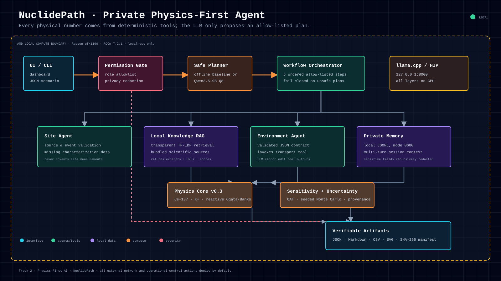
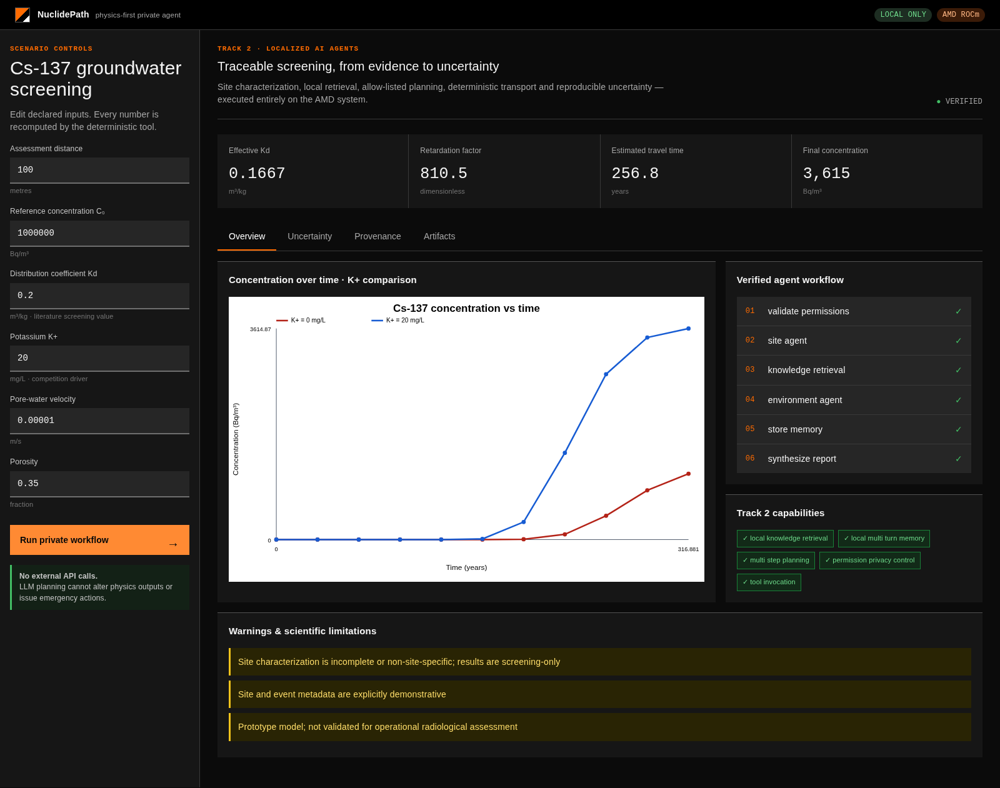

# NuclidePath

**A private, physics-first AI agent for traceable Cs-137 groundwater screening.**

AMD AI DevMaster Hackathon 2026 · **Track 2 — Development & Local Deployment of Private AI Agents**
Team: **Physics-First AI** · Application: **NuclidePath**

> **Current source state (5 August 2026):** `main` includes the merged
> schema-2 multicomponent PHREEQC bridge, independent arithmetic oracle,
> K-free Central Oklahoma fixtures, dynamic per-ion diagnostics and report
> integration, the dependency-free traceable Cs calibration/hold-out gate, and
> the separate EPA/Fuller/Dubus external Cs benchmark registry.
> The latest GitHub-hosted CI gate passed with `373 passed, 15 skipped`.
> This is GitHub-hosted CI evidence. A **post-merge AMD/ROCm rerun of the full
> current `main` tree** (5 August 2026) passed **388 tests,
> 2 skipped** (external-PHREEQC only) under `artifacts/amd-2026-08-05/post-merge/`.
> The calibration-gate evidence remains historical non-runner evidence
> for that specific gate.

> NuclidePath uses a local LLM to plan and explain. Every physical value is produced by a deterministic, versioned Python tool with explicit inputs, units, assumptions, provenance and uncertainty.





## Why this project

Emergency-analysis workflows cannot safely accept numbers invented by a language model. NuclidePath separates responsibilities:

- the private local model proposes a strict allow-listed plan;
- the Site Agent identifies missing characterization data instead of inventing it;
- local retrieval supplies cited scientific context;
- deterministic code calculates transport, the canonical K+ comparison and radioactive decay;
- seeded uncertainty analysis exposes parameter sensitivity;
- local memory preserves session context after recursively redacting sensitive fields;
- a SHA-256 manifest makes every generated artifact independently verifiable.

The current model is a transparent screening prototype, not a regulatory or operational emergency code. The `scenario-library-0.4` milestone adds three versioned demonstration families, virtual receptors, deterministic scenario preflight, and a constrained publication-schema gate without changing the `transport-prototype-0.3` or optional ROCm backend contracts.

## Track 2 capabilities — 5/5 implemented

| Required capability | NuclidePath evidence |
|---|---|
| Local knowledge retrieval | `LocalKnowledgeBase` retrieves ranked excerpts, paths, URLs and scores from bundled Markdown sources |
| Tool invocation | Environment Agent calls the versioned `simulate_transport` JSON contract |
| Multi-step planning | deterministic fallback or Qwen3.5-9B produces six allow-listed workflow steps |
| Local multi-turn memory | session-scoped JSONL, file mode `0600`, user/assistant turns and explicit deletion |
| Permission/privacy control | role allowlist, localhost-only defaults, recursive redaction and denied operational actions |

## Verified AMD deployment

| Component | Verified configuration |
|---|---|
| GPU | AMD Radeon Graphics, target `gfx1100` |
| ROCm | `7.2.1` |
| Runtime | `llama.cpp`, Release HIP build, all model layers offloaded |
| Local model | `unsloth/Qwen3.5-9B-GGUF`, `Q8_0` |
| Model SHA-256 | `809626574d0cb43d4becfa56169980da2bb448f2299270f7be443cb89d0a6ae4` |
| Context | 8192 tokens |
| Endpoint | `http://127.0.0.1:8000/v1` only |
| Prompt benchmark | `2877.30 ± 153.36 tokens/s` at 512 tokens (`0.3` rerun) |
| Generation benchmark | `67.66 ± 0.14 tokens/s` at 128 tokens (`0.3` rerun) |
| Full LLM-planned pipeline | `19.9692 s` for the verified `0.3` 128-sample AMD run; `0.0635364 s` deterministic offline baseline |

The final AMD/ROCm **core-platform evidence snapshot** (28 July 2026) passed 231 tests. The exact FP64 device-resident GCS→transport→receptor pipeline evaluated 147,456 concentrations in a 1.784 ms median, 137.09× faster than the canonical scalar reference, with `7.94e-14` maximum relative concentration error. The dependency-light controller gate was 216 pass/13 optional-PyTorch skips; the controller with CPU PyTorch passed 231. A **post-merge full-`main` AMD/ROCm rerun (5 August 2026) passed 388 tests, 2 skipped** (only the external-PHREEQC tests), with the FP64 platform benchmark reproducing 1.82 ms median / 132.8× / `7.94e-14` max error under `artifacts/amd-2026-08-05/post-merge/`. See [AMD platform benchmark](docs/AMD_PLATFORM_BENCHMARK.md) and [AMD LLM benchmark](docs/AMD_LLM_BENCHMARK.md).

## Architecture

```text
Dashboard / CLI
      │
PermissionPolicy ── denies network + operational control
      │
Safe planner ─────── deterministic or Qwen3.5-9B on AMD ROCm
      │
EmergencyWorkflow
      ├── SiteAgent ───────── missing data + screening limitations
      ├── LocalKnowledgeBase  ranked local evidence + citations
      ├── EnvironmentAgent ── deterministic transport contract
      ├── LocalMemoryStore ── private redacted multi-turn context
      └── Reporting ───────── sensitivity, Monte Carlo, SVG, manifest
```

The full diagram is available as [SVG](docs/assets/architecture.svg).

## Quick start — offline mode

Python 3.11+ is the only runtime requirement.

```bash
python3 -m venv .venv
. .venv/bin/activate
python -m pip install -e '.[test]'
pytest -q
```

Run the complete private-agent pipeline without an LLM:

```bash
nuclear-emergency-demo \
  --scenario scenarios/cs137_emergency_full.json \
  --knowledge-dir knowledge \
  --uncertainty-ranges scenarios/uncertainty_ranges.json \
  --output results/full-demo-offline \
  --samples 512 \
  --seed 42 \
  --session-id offline-demo
```

Latest code-bearing registry check (GitHub-hosted CI):

```text
373 passed, 15 skipped (external Cs registry integration)
```

The preceding calibration/hold-out gate:
370 passed, 15 skipped.

Preceding merged-bridge integration checkpoint:

```text
364 passed, 15 skipped (schema-2 bridge integration)
```

Core-platform evidence snapshot:
231 passed (AMD ROCm)
```

## PHREEQC chemistry bridge (opt-in)

**PROCESS-QUALIFIED ONLY.** Phase F established bounded, replayable execution of
an official PHREEQC slice. The new opt-in scenario compiler adds the first
scientific bridge: it maps a declared NuclidePath Cs-137 scenario, water
composition, CEC and Cs plus one or more declared K/Na/Ca/Mg exchange coefficients to a deterministic PHREEQC
input with aqueous speciation, cation exchange and 1-D transport.

Compile the included demonstration projection with:

```bash
nuclear-phreeqc-scenario \
  tests/fixtures/phreeqc/cs137_exchange_scenario.json \
  --output results/phreeqc-chemistry
```

To carry the opt-in bridge through the full private-agent report pipeline:

```bash
nuclear-emergency-demo \
  --scenario scenarios/cs137_phreeqc_bridge_demo.json \
  --output results/phreeqc-bridge-demo \
  --knowledge-dir knowledge \
  --uncertainty-ranges scenarios/uncertainty_ranges.json \
  --samples 512 --seed 42
```

This compiles the chemistry input and publishes it, its path-free metadata, and
a `phreeqc_bridge` section in `report.json`/ `report.md`. The ordinary
pipeline is compile-only; real PHREEQC execution remains a trusted manual
workflow on `refs/heads/main`.

The compiler requires explicit units, provenance, Cs, and at least one competitor
log K value. The competitor set may be K, Na, Ca, Mg; K-free cases are valid and
retain their component-specific output columns. It does not change the
canonical empirical Kd_eff path, does not insert radioactive decay into PHREEQC,
and does not invent missing thermodynamic data. The existing bounded adapter and
ReplayBundle can run and retain the generated chemistry evidence. This is a
first opt-in bridge toward a calibrated multi-cation chemistry-aware Kd
hierarchy. Its declared arithmetic contract is now labelled `NUMERICALLY
VERIFIED`, but it is not yet multi-cation scientific validation, experimental
agreement, GCS equivalence, general PHREEQC compatibility, or regulatory
validation. See [PHREEQC scenario compiler](docs/PHREEQC_SCENARIO_COMPILER.md),
[PHREEQC multicomponent cases](docs/PHREEQC_MULTICOMPONENT_CASES.md),
[PHREEQC numerical oracle](docs/PHREEQC_NUMERICAL_ORACLE.md), [Cs exchange
calibration gate](docs/SCIENTIFIC_VALIDATION_GATE.md), and [bounded PHREEQC
qualification](docs/PHREEQC_QUALIFICATION.md). The calibration gate is offline
infrastructure only and remains closed because no traceable experimental
dataset is bundled.

## Dashboard

```bash
nuclear-emergency-dashboard \
  --host 127.0.0.1 \
  --port 8080 \
  --samples 256
```

Open <http://127.0.0.1:8080>. The server accepts loopback hosts only; public network binds are intentionally disabled because the dashboard has no remote-authentication layer.

The dashboard exposes:

- editable physical inputs and immediate deterministic recalculation;
- K+ comparison and concentration-time SVG;
- the complete agent execution plan;
- all five Track 2 capability indicators;
- scientific warnings and missing site data;
- local evidence with source URLs and retrieval scores;
- P05/P50/P95 uncertainty intervals;
- downloadable checksummed artifacts.

## AMD-local LLM mode

Start the verified `llama.cpp` endpoint on the AMD system, then use:

```bash
nuclear-emergency-demo \
  --scenario scenarios/cs137_emergency_full.json \
  --knowledge-dir knowledge \
  --uncertainty-ranges scenarios/uncertainty_ranges.json \
  --output results/full-demo-llm \
  --samples 128 \
  --planner llm \
  --llm-base-url http://127.0.0.1:8000/v1 \
  --llm-model qwen35-9b-q8 \
  --session-id amd-llm
```

No cloud API is required. The CLI rejects non-loopback LLM endpoints and URLs containing credentials. The LLM receives the scenario only to propose this plan:

```json
[
  "validate_permissions",
  "site_agent",
  "knowledge_retrieval",
  "environment_agent",
  "store_memory",
  "synthesize_report"
]
```

The orchestrator rejects unknown, missing, duplicated or reordered steps before any tool runs.

## Generated artifacts

A full run creates:

| File | Purpose |
|---|---|
| `report.json` | complete machine-readable report, workflow and analyses |
| `report.md` | human-readable technical report |
| `concentration_vs_time.svg` | deterministic K+ comparison |
| `workflow.json` | plan, agents, evidence, permissions and memory status |
| `sensitivity.json/.csv` | low/baseline/high one-at-a-time analysis |
| `uncertainty.json/.csv/.svg` | reproducible Monte Carlo quantiles |
| `memory.jsonl` | local redacted multi-turn session state |
| `manifest.json` | SHA-256 checksum for every other artifact |

A clean installed-wheel run includes every current bundled scientific dataset. The submission-level manifest at `submission/ARTIFACT_MANIFEST.json` verifies twenty-two tracked core Track 2 editorial, visual and AMD evidence artifacts; it does not claim a trusted PHREEQC multicomponent run.

### Versioned scenario library

Run a provenance-bearing library entry with the same CLI:

```bash
nuclear-emergency-demo \
  --scenario scenarios/library/conservative_uncertainty_v1.json \
  --output results/library-case \
  --samples 512 --seed 42
```

This deterministic path validates the scenario and parameter provenance, screens declared virtual receptors with seeded P05/P50/P95 arrival/concentration distributions, applies the Report Safety Gate before publication, and writes `report.json`, `report.md`, `virtual_receptors.svg`, `scenario_validation.json`, and a SHA-256 `manifest.json`. Values not tied to the cited PNNL/DDEP sources are explicitly demonstration-labelled; no regulatory criteria are included. See [Versioned scenario library](docs/SCENARIO_LIBRARY.md).

## Physics model

`transport-prototype-0.3` evaluates the reactive Ogata–Banks solution on a saturated semi-infinite 1-D domain:

```text
R ∂C/∂t = D ∂²C/∂x² − v ∂C/∂x − λ R C
C(x,0)=0 (x>0) · C(0,t)=C0 · C(∞,t)=0

Kd_eff = Kd / (1 + alpha_K · [K+])
R      = 1 + rho_b · Kd_eff / porosity
A      = sqrt(v² + 4 λ R D)

C/C0 = 0.5 × [
  exp((v−A)x/(2D)) erfc((Rx−At)/(2 sqrt(DRt)))
  + exp((v+A)x/(2D)) erfc((Rx+At)/(2 sqrt(DRt)))
]
```

`v` is pore-water velocity. `C0` is a maintained boundary concentration, not an undefined pulse mass. Independent tests verify the non-reactive Ogata–Banks limit, exact source boundary, reactive steady state, retardation, strict finite inputs and bounded monotone breakthrough. The numerically difficult `exp(a)·erfc(z)` term is evaluated in the log domain.

### Parameter provenance

Inputs are classified as:

- **site-measured** — supplied from a real characterization programme;
- **literature range/default** — traceable to an identified source;
- **demonstration range** — chosen to exercise software behaviour and never presented as site truth.

The included scenario is explicitly demonstrative. Its `Kd = 0.2 m³/kg` is a low-end literature screening value; the K+ competition coefficient and several uncertainty brackets require experimental/site calibration.

## Safety and limitations

NuclidePath does **not**:

- calculate regulatory dose or declare a location safe;
- model 2-D/3-D heterogeneity, transient flow, nonlinear/kinetic sorption, colloids, preferential paths or daughter products;
- issue public alerts, protective-action recommendations or equipment commands;
- replace qualified authorities, calibrated site models or validated regulatory software.

Operational-control, external-network and public-alert actions are denied by policy. Results are preliminary screening outputs for research and demonstration only.

## Documentation

### Version matrix

| Surface | Version | Meaning |
|---|---|---|
| Python package | `0.1.0` | installable distribution version |
| Transport model | `transport-prototype-0.3` | reactive Ogata–Banks physics contract |
| Scenario library | `scenario-library-0.4` | versioned scenarios, receptors and safety gate |
| Multi-species contract | `nuclidepath-multispecies-2.0` | opt-in Cs-137/Sr-90 schema |
| Primary Cs GCS | `bradbury-baeyens-gcs-2.0` | primary-paper K/Na/NH4 three-site model in opt-in v2 |
| GCS paper reconstructions | `bradbury-rocks-1.0` | Tables 4–5 inputs, illite envelopes and demonstrative systematic Kc uncertainty |
| Exact GCS batch backend | `torch-exact` | optional FP64/FP32 PyTorch batching; ROCm-compatible, no learned approximation |
| GCS surrogate | `gcs-surrogate-v1` | guarded approximation of the retained legacy Cs/K oracle |
| Private hackathon tag | `v0.3.0-hackathon` | exists with a historical private video asset; not the current judge-accessible release |

These are separate compatibility labels; none implies regulatory validation.

- [Project specification](docs/SPECIFICATION.md)
- [Architecture](docs/ARCHITECTURE.md)
- [Scientific validation](docs/VALIDATION.md)
- [Uncertainty and parameter provenance](docs/UNCERTAINTY.md)
- [Privacy and permissions](docs/PRIVACY.md)
- [Tool contracts](docs/CONTRACTS.md)
- [Parameters and sources](docs/PARAMETERS.md)
- [AMD environment](docs/AMD_ENVIRONMENT.md)
- [LLM deployment benchmark](docs/AMD_LLM_BENCHMARK.md)
- [AMD scientific transport benchmark](docs/AMD_SCIENTIFIC_BENCHMARK.md)
- [AMD exact GCS and platform benchmark](docs/AMD_PLATFORM_BENCHMARK.md)
- [Deterministic Cs/K GCS foundation](docs/GCS_FOUNDATION.md)
- [Multi-isotope contract v2](docs/MULTISPECIES_V2.md)
- [Guarded GCS surrogate and AMD evidence](docs/GCS_SURROGATE.md)
- [Demo scenario and recording script](docs/DEMO_SCENARIO.md)
- [Versioned scenarios, virtual receptors, validation and report safety](docs/SCENARIO_LIBRARY.md)
- [Final English video narration](docs/VIDEO_NARRATION.md)
- [Official submission checklist](docs/SUBMISSION_CHECKLIST.md)
- [Current release state](docs/RELEASE_STATE.md)
- [PHREEQC scenario compiler](docs/PHREEQC_SCENARIO_COMPILER.md)
- [PHREEQC bounded qualification](docs/PHREEQC_QUALIFICATION.md)
- [PHREEQC multicomponent cases](docs/PHREEQC_MULTICOMPONENT_CASES.md)

## Repository layout

```text
knowledge/                  bundled scientific retrieval corpus
scenarios/                  full scenario and declared uncertainty ranges
src/nuclear_agent/          agents, physics, analysis, pipeline and dashboard
tests/                      analytical, security, workflow, API and artifact tests
docs/                       specification, evidence and submission material
scripts/                    deck, PDF and 3–5 minute demo-video generators
submission/                 checksummed PPTX/PDF package; hosted video is external
```

## Team

**Physics-First AI** — built by Stefano Rigante, nuclear engineer focused on contaminant transport, cesium adsorption and applied local AI.

## License

MIT. See [LICENSE](LICENSE).
