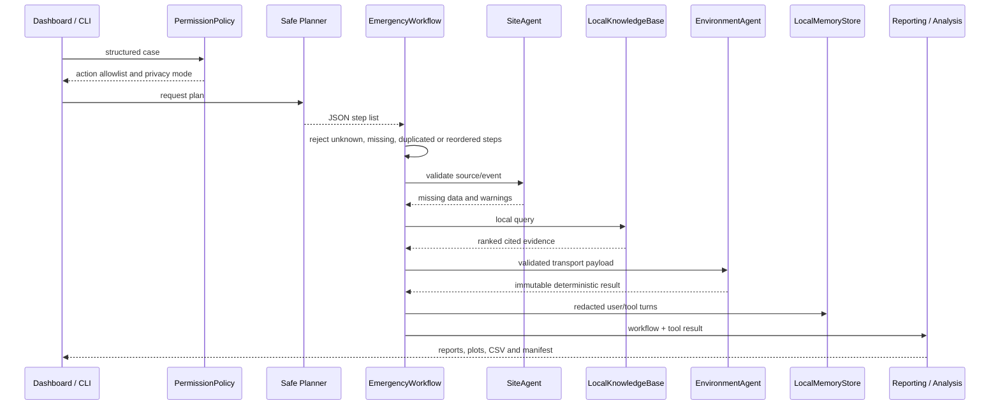

# NuclidePath Architecture


## 1. Design principle

NuclidePath is **physics-first** and **fail-closed**:

- a local LLM may plan and explain;
- it may not calculate, modify or replace physical outputs;
- every allowed operation has a deterministic implementation and JSON contract;
- permission checks occur before site, retrieval, tool or memory actions;
- unknown plan steps and unknown input fields are rejected.

## 2. Components

### Interfaces

- `nuclear-emergency-demo`: full CLI and legacy flat-scenario compatibility.
- `nuclear-emergency-dashboard`: localhost web UI and JSON API.
- `src/nuclear_agent/static/index.html`: zero-dependency responsive dashboard.

### Security boundary

`PermissionPolicy` provides role allowlists, local-only network policy, permanent denial of operational actions and recursive sensitive-field redaction. The dashboard rejects public binds by default. `llama.cpp` listens on `127.0.0.1` only.

### Planners

- `DeterministicWorkflowPlanner`: CI, offline and fallback plan.
- `LocalWorkflowPlanner`: strict OpenAI-compatible local LLM adapter.

Both plans are validated by `EmergencyWorkflow` against required and allowed steps. LLM output must be a JSON string list.

### Agents and stores

- `SiteAgent`: validates source/event metadata and identifies missing site characterization.
- `LocalKnowledgeBase`: ranked local retrieval with excerpts, file paths, URLs and scores.
- `EnvironmentAgent` / `run_transport_contract`: deterministic Cs-137 tool invocation.
- `LocalMemoryStore`: mode-0600 JSONL session memory with redaction and deletion.

### Physics and analysis

- `transport.py`: effective Kd, retardation and the reactive Ogata–Banks constant-source solution.
- `analysis.py`: low/baseline/high sensitivity and seeded Monte Carlo.
- `reporting.py`: K+ comparison, report JSON/Markdown and concentration SVG.
- `pipeline.py`: full workflow, CSV/SVG analyses and SHA-256 manifest.
- `phreeqc_scenario.py`: opt-in, explicit multicomponent chemistry compiler,
  dynamic selected-output parser and comparative diagnostics.
- `phreeqc_qualification.py` / `external_adapters.py`: bounded external process,
  closed output and ReplayBundle contracts.

## 3. Execution sequence



The opt-in PHREEQC branch starts from the validated scenario/report path and
returns compile-only or replayable comparative evidence. It never changes the
canonical transport result automatically.

## 4. Data boundary

The composite scenario has three independent sections:

```json
{
  "site": {
    "radionuclide": "Cs-137",
    "data_provenance": "demonstration"
  },
  "transport": {
    "scenario_id": "cs137-realistic-groundwater",
    "distribution_coefficient_m3_kg": 0.2,
    "potassium_mg_l": 20.0
  },
  "query": "How does potassium competition affect Cs-137 transport?"
}
```

The LLM sees the case only to choose plan steps. `ScenarioInput` independently validates the transport object and constructs `TransportParameters`. The report stores the original normalized scenario separately from comparative K+ runs.

## 5. Result contract

A transport result includes:

```json
{
  "tool": "simulate_transport",
  "model_version": "transport-prototype-0.3",
  "scenario_id": "cs137-realistic-groundwater",
  "inputs": {},
  "points": [
    {
      "time_s": 0.0,
      "concentration_bq_m3": 0.0,
      "effective_kd_m3_kg": 0.1666666667,
      "retardation_factor": 810.5238095,
      "travel_time_s": 8105238095.2,
      "decay_factor": 1.0
    }
  ],
  "assumptions": [],
  "warnings": []
}
```

The numbers above illustrate the schema; actual output is always generated by code.

## 6. Deployment topology

```text
AMD cloud workspace
├── llama.cpp HIP server
│   ├── Qwen3.5-9B Q8_0
│   ├── gfx1100 / ROCm 7.2.1
│   └── 127.0.0.1:8000/v1
└── NuclidePath Python process
    ├── dashboard: 127.0.0.1:8080
    ├── deterministic tools
    ├── bundled knowledge corpus
    ├── private JSONL memory
    └── local results directory
```

The runtime has no cloud inference dependency and no mandatory Python package beyond the standard library.

## 7. Security decisions

- **No public listener.** The dashboard and LLM endpoint are restricted to loopback addresses; network binds are disabled.
- **No secrets in CLI arguments.** Optional local API tokens are read from `LLM_API_KEY`.
- **No implicit tool execution.** Plan steps are allow-listed and complete-order validated.
- **No operational actions.** Equipment control, public alerts and operational control are permanently denied.
- **No raw personal metadata in memory.** Known sensitive keys are recursively redacted.
- **No unverifiable artifacts.** The manifest hashes every generated output except itself.

## 8. Failure behaviour

| Failure | Behaviour |
|---|---|
| local LLM unavailable | use deterministic planner |
| malformed LLM response | reject before tool execution |
| unknown/missing plan step | reject before tool execution |
| invalid site or transport field | fail with explicit field error |
| non-finite physical value | reject |
| retrieval no match | empty evidence list, capability flag false |
| unsafe role/action | raise `PermissionDenied` |
| invalid dashboard session/path | HTTP 400; no file escape |

## 9. Extension points

- additional radionuclides and validated transport kernels;
- calibrated site databases with explicit access policy;
- native structured tool calling while preserving the same contract boundary;
- CPU LLM runtime for environments without ROCm;
- benchmark suite across quantizations and context lengths;
- a narrow PHREEQC scenario compiler and future calibrated chemistry adapters.
